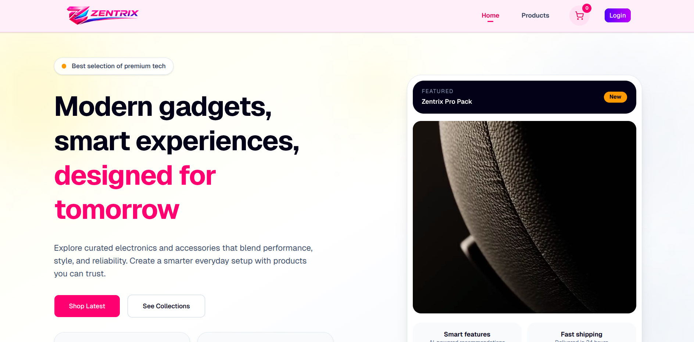
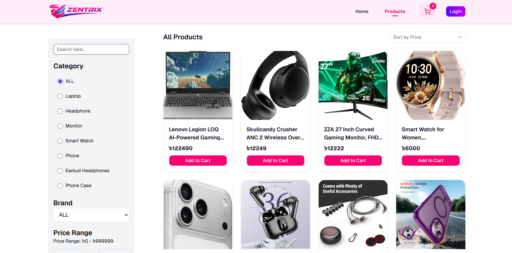
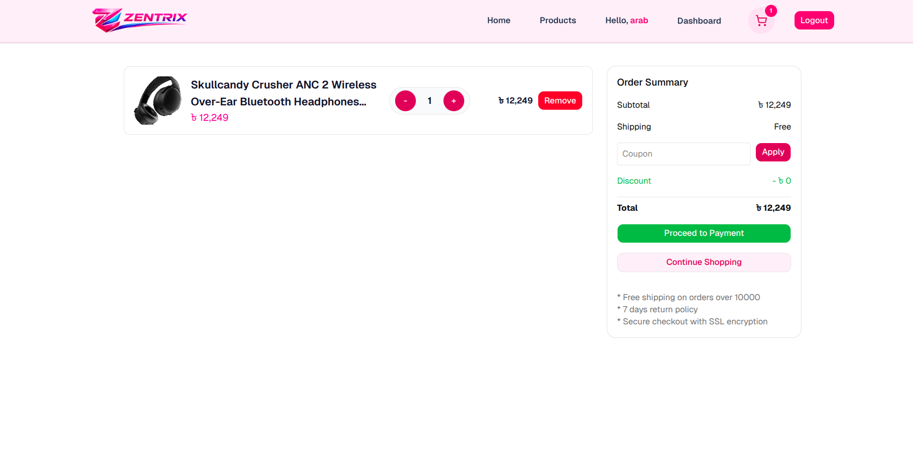
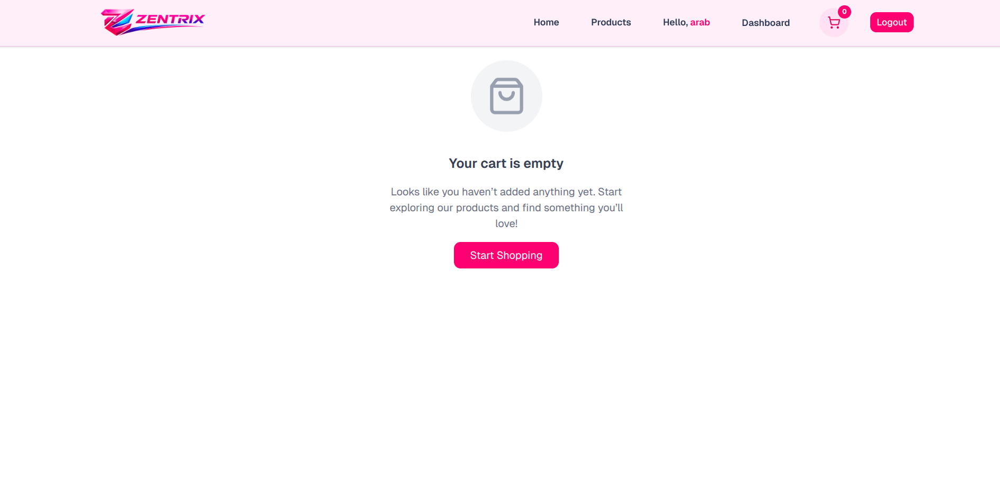
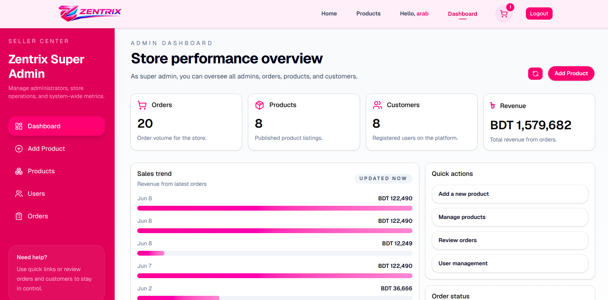
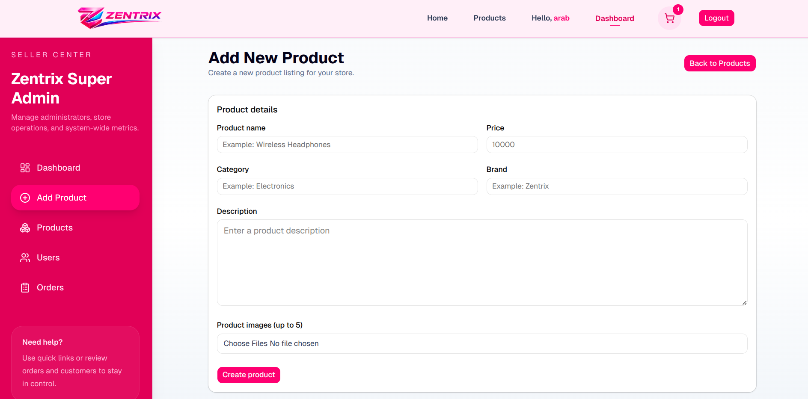
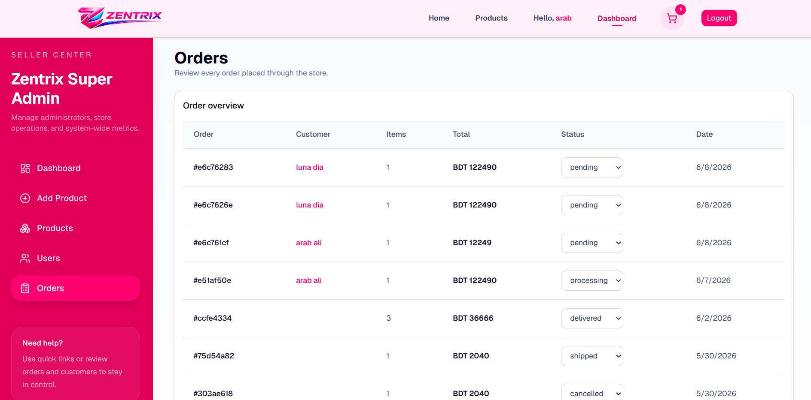

# Zentrix

Zentrix is a full-stack scalable e-commerce platform with admin control, secure authentication, and modern UI designed to simulate real-world online shopping systems.

---

<p align="center">
  <a href="https://zentrix-green.vercel.app/" target="_blank">
    
  </a>
</p>

## 🌟 Features

### 👤 User Features

* User Registration & Login
* JWT Authentication
* Secure Password Hashing
* Browse Products
* Product Details Page
* Add to Cart
* Remove from Cart
* Update Cart Quantity
* Responsive Shopping Experience
* User Profile Management

### 🛒 E-Commerce Features

* Product Listing System
* Product Categories
* Shopping Cart Management
* Order Processing
* Dynamic Product Details
* Inventory Ready Architecture

### 🛠 Admin Features

* Admin Dashboard
* Product Management (CRUD)
* User Management
* Order Monitoring
* Role-Based Access Control
* Protected Admin Routes

### 🔒 Security Features

* JWT Authentication
* Protected API Routes
* Role-Based Authorization
* Secure Password Encryption using bcrypt
* Environment Variable Protection


## 📸 UI Showcase

---

### 🏠 Home & Product Pages

<p align="center">
  
  
</p>

---

### 🛒 Cart Experience

<p align="center">
  
  
</p>

---

### 🛠 Admin Dashboard

<p align="center">
  
  
  
</p>
---

### 🎯 Full Application Preview

<p align="center">
  
</p>

---

## 🏗 Tech Stack

### Frontend

* React.js
* Vite
* Redux Toolkit
* React Router DOM
* Axios
* Tailwind CSS
* Shadcn UI
* Lucide React Icons

### Backend

* Node.js
* Express.js
* MongoDB
* Mongoose
* JWT (JSON Web Token)
* bcryptjs
* dotenv
* CORS

### Development Tools

* Git
* GitHub
* Postman
* VS Code

---

## 📁 Project Structure

```bash
Zentrix/
│
├── backend/
│   ├── controllers/
│   ├── middleware/
│   ├── models/
│   ├── routes/
│   ├── utils/
│   ├── config/
│   ├── server.js
│   ├── package.json
│   └── .env
│
├── frontend/
│   ├── public/
│   ├── src/
│   │   ├── assets/
│   │   ├── components/
│   │   ├── pages/
│   │   ├── redux/
│   │   ├── hooks/
│   │   ├── layouts/
│   │   ├── App.jsx
│   │   └── main.jsx
│   │
│   ├── package.json
│   ├── vite.config.js
│   └── index.html
│
├── .gitignore
└── README.md
```

---

## ⚙️ Installation & Setup

### 1️⃣ Clone Repository

```bash
git clone https://github.com/kmziaur/Zentrix.git
cd Zentrix
```

---

## 🔑 Environment Variables

Create a `.env` file inside the backend folder:

```env
PORT=8000

MONGO_URI=your_mongodb_connection_string

JWT_SECRET=your_jwt_secret_key

NODE_ENV=development
```

---

## 📦 Backend Setup

```bash
cd backend
npm install
npm run dev
```

Backend runs on:

```bash
http://localhost:8000
```

---

## 💻 Frontend Setup

```bash
cd frontend
npm install
npm run dev
```

Frontend runs on:

```bash
http://localhost:5173
```

---

## 🔗 API Endpoints

### Authentication

```http
POST /api/v1/user/register
POST /api/v1/user/login
POST /api/v1/user/logout
GET  /api/v1/user/profile
```

### Products

```http
GET    /api/v1/product
GET    /api/v1/product/:id
POST   /api/v1/product/create
PUT    /api/v1/product/update/:id
DELETE /api/v1/product/delete/:id
```

### Cart

```http
GET    /api/v1/cart
POST   /api/v1/cart/add
PUT    /api/v1/cart/update
DELETE /api/v1/cart/remove/:id
```

### Orders

```http
POST /api/v1/order/create
GET  /api/v1/order
GET  /api/v1/order/:id
```

---

## 🔄 Application Flow

```bash
User
 │
 ▼
Frontend (React)
 │
 ▼
Axios API Requests
 │
 ▼
Backend (Express.js)
 │
 ▼
MongoDB Database
```

---

## 🔐 Authentication Flow

```bash
User Login
    │
    ▼
JWT Token Generated
    │
    ▼
Token Stored
    │
    ▼
Protected Routes
    │
    ▼
Authorized Access
```

---

## 📱 Responsive Design

ZENTRIX is fully optimized for:

* Desktop
* Laptop
* Tablet
* Mobile Devices

---

## 🚀 Upcoming Features

* SSLCOMMERZ Payment Gateway
* Wishlist System
* Product Reviews & Ratings
* Coupon & Discount System
* Multi-Vendor Support

---

## ⚡ Performance Optimizations

* Redux State Management
* Reusable Components
* Modular Backend Architecture
* Optimized API Calls
* Protected Route System
* Efficient Database Queries

---

## 📄 License

This project is licensed under the MIT License.

---

## 👨‍💻 Developer

### K. M. Ziaur Rahman

GitHub:

https://github.com/kmziaur

Repository:

https://github.com/kmziaur/Zentrix

---

⭐ If you like this project, don't forget to give it a star.
